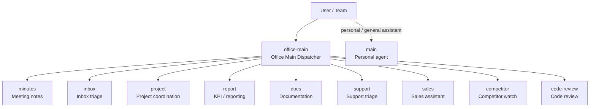

# oktoclaw

Toolkit untuk membangun **OpenClaw office stack**: kumpulan persona, prompt pack, contoh output, dan workflow multi-agent untuk kebutuhan kerja kantor.

Repo ini cocok kalau kamu ingin:
- menjalankan beberapa agent OpenClaw di **1 server**
- memisahkan agent personal dan agent kantor
- punya persona siap pakai untuk kerjaan seperti meeting notes, inbox triage, project coordination, reporting, docs, support, sales, competitor watch, dan code review
- menguji kualitas agent dengan test plan yang jelas

## License

This project is licensed under the **MIT License**. See [`LICENSE`](LICENSE).

## Start here

### If you want templates only
Buka:
- `office-personas/`

Cocok kalau kamu cuma ingin:
- ambil template `SOUL.md`
- eksperimen cepat dengan persona
- bikin agent baru dari contoh sederhana

### If you want the full office-agent stack
Buka:
- `openclaw-office-stack/README.md`

Cocok kalau kamu ingin:
- setup multi-agent kantor yang lebih rapi
- pakai dispatcher + specialist agents
- pakai prompt pack, examples, testing docs, dan workflow yang sudah disiapkan

## What's inside

Repo ini punya 2 bagian utama:

### `office-personas/`
Koleksi **template `SOUL.md`** untuk berbagai use case kantor.

Cocok untuk:
- copy-paste persona dengan cepat
- eksperimen per role
- bikin agent baru dari template ringan

Use case yang tersedia:
- project coordinator
- standup facilitator
- meeting notes
- inbox triage
- report analyst
- code reviewer
- docs writer
- sales assistant
- support triage
- competitor watch

### `openclaw-office-stack/`
Paket implementasi yang lebih lengkap untuk **multi-agent office setup**.

Isinya:
- struktur agent stack
- bootstrap script
- naming map agent
- cheatsheet penggunaan
- prompt siap copas
- contoh input/output
- test plan + review checklist

Kalau tujuanmu bukan cuma lihat persona tapi benar-benar mau deploy dan pakai stack kantor, mulai dari folder ini.

## Architecture

Repo ini membedakan **agent personal** dan **agent kantor**.

### Personal agent
- `main` → agent personal/default yang sudah ada sebelumnya

### Office dispatcher
- `office-main` → pintu depan untuk workflow kantor

### Office specialist agents
- `minutes`
- `inbox`
- `project`
- `report`
- `docs`
- `support`
- `sales`
- `competitor`
- `code-review`

Lihat juga:
- `openclaw-office-stack/AGENT-MAP.md`

## Architecture diagram



## How the flow works

1. **User masuk ke `office-main`** saat request masih campuran atau belum jelas bentuk kerjanya.
2. `office-main` memecah request menjadi workstream yang lebih spesifik.
3. Workstream diarahkan ke agent spesialis yang paling cocok.
4. Output agent spesialis bisa dipakai langsung atau dirapikan lagi untuk kebutuhan tim.
5. Agent `main` personal tetap terpisah untuk kebutuhan personal / non-office.

## Recommended usage flow

Kalau baru mulai, pakai urutan ini:

1. `office-main`
2. `minutes`
3. `inbox`
4. `project`

Lalu tambah agent lanjutan:
- `report`
- `docs`
- `support`
- `sales`
- `competitor`
- `code-review`

## Quick start

### 1. Explore the stack
Mulai dari file ini:
- `openclaw-office-stack/README.md`

### 2. Use ready-made references
- `openclaw-office-stack/PROMPTS.md`
- `openclaw-office-stack/CHEATSHEET.md`
- `openclaw-office-stack/EXAMPLES.md`
- `openclaw-office-stack/QUICK-REFERENCE.md`
- `openclaw-office-stack/KEYWORDS.md`

### 3. Understand tuning improvements
- `openclaw-office-stack/BEFORE-VS-AFTER.md`

### 4. Run quality tests
- `openclaw-office-stack/TEST-PLAN.md`
- `openclaw-office-stack/TEST-RUN-CHECKLIST.md`
- `openclaw-office-stack/TEST-REPORT.md`

## Setup example

### Bootstrap the office stack
```bash
bash /root/.openclaw/workspace/openclaw-office-stack/scripts/bootstrap.sh
```

### Register the agents in OpenClaw
```bash
openclaw agents add office-main --non-interactive --workspace /opt/openclaw/instances/main/workspace
for a in minutes inbox project report docs support sales competitor code-review; do
  openclaw agents add "$a" --non-interactive --workspace "/opt/openclaw/instances/$a/workspace"
done
```

## Repo map

```text
.
├── LICENSE
├── CHANGELOG.md
├── README.md
├── office-personas/
│   ├── 01-orion-project-coordinator/
│   ├── 02-standup-facilitator/
│   ├── 03-minutes-meeting-notes/
│   ├── 04-inbox-triage/
│   ├── 05-report-analyst/
│   ├── 06-code-reviewer/
│   ├── 07-docs-writer/
│   ├── 08-sales-assistant/
│   ├── 09-support-triage/
│   ├── 10-competitor-watch/
│   └── README.md
└── openclaw-office-stack/
    ├── README.md
    ├── AGENT-MAP.md
    ├── BEFORE-VS-AFTER.md
    ├── CHEATSHEET.md
    ├── EXAMPLES.md
    ├── KEYWORDS.md
    ├── PROMPTS.md
    ├── QUICK-REFERENCE.md
    ├── TEST-PLAN.md
    ├── TEST-REPORT.md
    ├── TEST-RUN-CHECKLIST.md
    └── scripts/
```

## Who this repo is for

Repo ini paling cocok untuk:
- founder / operator yang ingin asisten kantor multi-role
- tim kecil yang butuh office automation ringan
- pengguna OpenClaw yang ingin mulai dari template, bukan dari nol
- orang yang mau eksperimen dengan agent specialization tanpa setup terlalu abstrak

## Notes

- Repo ini fokus pada **persona design, prompt assets, testing, dan workflow**
- Ini bukan platform SaaS siap jual; ini lebih seperti **starter kit / operating kit** untuk OpenClaw office agents
- `main` personal dibiarkan terpisah supaya tidak bentrok dengan workflow kantor

## Suggested next step

Kalau baru datang ke repo ini, buka file berikut secara berurutan:
1. `openclaw-office-stack/README.md`
2. `openclaw-office-stack/CHEATSHEET.md`
3. `openclaw-office-stack/PROMPTS.md`
4. `openclaw-office-stack/TEST-PLAN.md`
